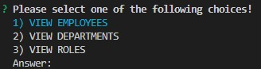
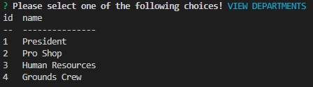
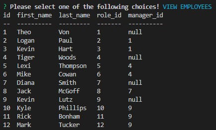
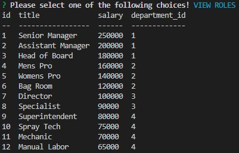
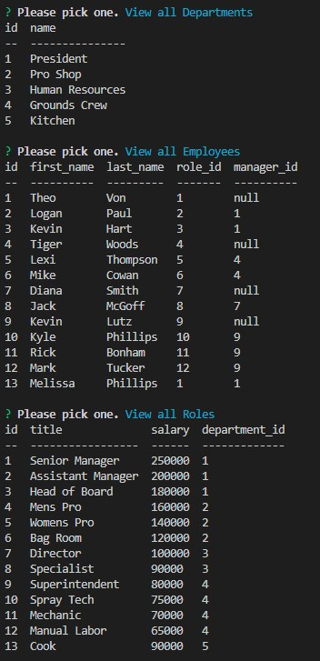

# Employee-Tracker

## Table of Content
- [Description](#description)
- [Visuals](#visuals)
- [Links](#links)

***

## Description
This challenge was to build a Employee Tracker that tracked Employees, Departments, and also thier Roles. 

The goal was to build a command-line application from scratch to manage a company's

 employee database, using Node.js, Inquirer, and also MySQL. To start the process your need to run mysql -uroot, then once 
 
 inside of mysql you run source db/schema.sql;, once have ran that you run source db/seeds.sql;. Once both of those have been ran you exit 

 mysql and run node server.js. You can pick any option to view or you can also pick an option to add a department, role, or employee.

***
## Visuals
Choices 

Departments

Employees

Roles

<!-- ------------------------------------------------------------- -->

New Department added called Kitchen with Role of Cook and Employee name Melissa

***

## Links
Link to GitHub:
[Employee-Tracker](https://github.com/KMPhillips20/Employee-Tracker)

Link to walkthrough video: 
[Walk-Through-Video](https://drive.google.com/file/d/1-OkfE4DNLGZTO8ZyGY5ql_RBJZ2On27e/view)
***

